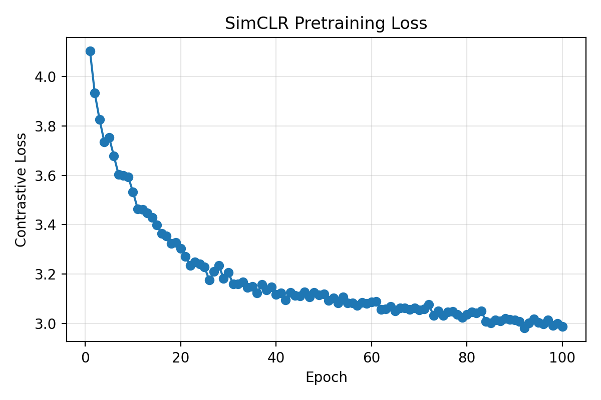
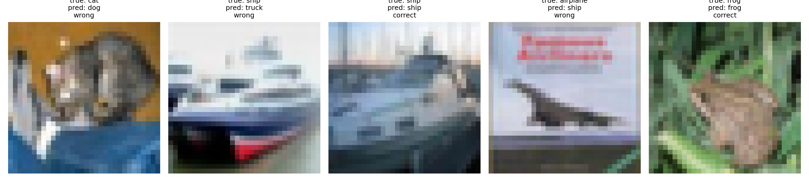

# Mini-SimCLR 图像表征学习复现实验报告

## 1. 论文信息

- 论文名称：A Simple Framework for Contrastive Learning of Visual Representations
- 论文作者：Ting Chen, Simon Kornblith, Mohammad Norouzi, Geoffrey Hinton
- 论文地址：https://arxiv.org/abs/2002.05709
- 官方代码参考：https://github.com/google-research/simclr

本实验复现的是 SimCLR 的轻量版本，重点不是在 CIFAR-10 上追求高精度，而是跑通“自监督预训练 + 冻结 encoder + linear probe 评估”的完整流程。

## 2. 任务说明

本实验使用无标签图像进行自监督预训练。训练时，对同一张图像生成两种随机增强视图，模型需要让同一原图的两种增强视图在投影空间中更接近，让不同图像的视图更远。评估阶段丢弃 projection head，冻结 encoder，只训练一个线性分类器，在 CIFAR-10 测试集上报告分类准确率。

```text
预训练输入：无标签 CIFAR-10 图像
预训练目标：学习图像表征，使正样本对更接近、负样本对更远
评估方式：冻结 encoder，训练 linear probe，报告 test accuracy
```

## 3. 数据集

- 数据集名称：CIFAR-10
- 数据集地址：https://www.cs.toronto.edu/~kriz/cifar.html
- 预训练数据来源：CIFAR-10 train split
- Linear probe 数据来源：CIFAR-10 train split
- 测试数据来源：CIFAR-10 test split
- 使用设备：CUDA GPU 
- 总训练耗时：未单独计时

当前仓库中有两类实验记录：`logs/pretrain.log` 记录了 100 epoch 的自监督预训练 loss；`results/linear_probe_results.json` 保存了一次 1000 训练样本、1000 测试样本、3 epoch linear probe 的结果。报告中的预训练过程以日志为准，linear probe 精度以结果文件为准。

## 4. 数据增强

代码位置：`code/Dataset.py`

| 增强方法 | 参数设置 |
|---|---|
| RandomResizedCrop | `size=32, scale=(0.2, 1.0)` |
| RandomHorizontalFlip | `p=0.5` |
| ColorJitter | `brightness=0.4, contrast=0.4, saturation=0.4, hue=0.1` |
| RandomGrayscale | `p=0.2` |
| GaussianBlur | 未使用 |

这些增强适合 SimCLR，是因为它们可以在不改变图像语义类别的前提下制造视角、颜色、亮度和灰度变化。模型不能只记住像素细节，而需要学习更稳定的语义表征。`TwoCropTransform` 对同一张图像独立调用两次 transform，得到 `view1` 和 `view2`，满足 SimCLR 的双视图训练要求。

## 5. 模型结构

代码位置：`code/model.py`

```text
Image -> Two Augmented Views -> Shared CNN Encoder -> Projection Head -> NT-Xent Loss
```

### 5.1 Encoder

- encoder 类型：小型 CNN
- 输入尺寸：`[B, 3, 32, 32]`
- 输出特征维度：128
- 是否使用预训练权重：否

Encoder 由 3 个卷积层构成，前两层后接 ReLU 和 MaxPool，最后通过 `AdaptiveAvgPool2d((1, 1))` 和 `Flatten` 输出 128 维图像表征。

### 5.2 Projection Head

- MLP 层数：2 层 Linear
- hidden dimension：512
- output dimension：128
- 激活函数：ReLU
- BatchNorm：未使用

Projection head 结构为：

```text
Linear(128 -> 512) -> ReLU -> Linear(512 -> 128)
```

### 5.3 Linear Probe

代码位置：`code/linear_probe.py`

- encoder 是否冻结：是
- linear classifier 输入维度：128
- 类别数：10
- classifier 结构：`Linear(128 -> 10)`

Linear probe 阶段加载 `checkpoints/simclr_encoder.pth`，冻结 encoder 参数，只更新线性分类器。

## 6. Loss 实现

代码位置：`code/loss.py`

NT-Xent loss 的实现流程如下：

- 输入：两组 projection，`z1` 和 `z2`，形状均为 `[N, 128]`
- 拼接：`torch.cat([z1, z2], dim=0)` 得到 `[2N, 128]`
- 归一化：使用 `F.normalize(z, dim=1)` 做 L2 normalize
- 相似度矩阵：`torch.matmul(z, z.T)` 得到 `[2N, 2N]`
- temperature：`0.5`
- 去除自身相似度：用单位矩阵 mask，把对角线填成 `-1e9`
- 正样本索引：前 N 个样本的正样本是后 N 个对应样本，后 N 个样本的正样本是前 N 个对应样本
- 损失函数：`F.cross_entropy(logits, labels)`

当 batch size 为 64 时，logits shape 为 `[128, 128]`。对角线是自身样本，不作为候选正负样本参与训练。

## 7. 训练设置

### 7.1 自监督预训练

代码位置：`code/pretrain.py`

| 配置 | 数值 |
|---|---:|
| train images | 5000 |
| epochs | 100 |
| batch size | 64 |
| optimizer | Adam |
| learning rate | 0.001 |
| temperature | 0.5 |
| encoder | 小型 CNN |
| device | 自动选择 CUDA / CPU |

### 7.2 Linear Probe

结果文件位置：`results/linear_probe_results.json`

| 配置 | 数值 |
|---|---:|
| train images | 1000 |
| test images | 1000 |
| epochs | 3 |
| batch size | 32 |
| optimizer | Adam |
| learning rate | 0.001 |
| device | 自动选择 CUDA / CPU |

说明：当前 `code/linear_probe.py` 中的参数已经被改为 5000 样本、100 epoch、batch size 64，但已保存的 `results/linear_probe_results.json` 仍是 1000 样本、3 epoch 的实验结果。因此报告中的 accuracy 使用结果文件中可追溯的数值。

## 8. 训练过程

完整日志见：`logs/pretrain.log`

| Epoch | Contrastive Loss |
|---|---:|
| 1 | 4.1025 |
| 2 | 3.9322 |
| 3 | 3.8260 |
| 10 | 3.5329 |
| 20 | 3.3041 |
| 50 | 3.1189 |
| 75 | 3.0313 |
| 100 | 2.9870 |

Loss 曲线见：



从日志看，contrastive loss 从 4.1025 下降到 2.9870，整体趋势是下降的，但后半段下降速度明显变慢，并伴随小幅波动。这说明模型确实在学习表征，但受限于模型较小、数据量有限、batch size 不大以及训练轮数有限，loss 不会持续快速下降。

## 9. Linear Probe 结果

| 指标 | 结果 |
|---|---:|
| test accuracy | 23.00% |
| random baseline | 10.00% |

Linear probe accuracy 为 23.00%，高于 CIFAR-10 随机猜测的 10%。这说明自监督预训练得到的 encoder 学到了一定可用于分类的图像表征。不过精度仍然不高，主要原因可能包括：

- encoder 使用的是较浅的小型 CNN，表达能力有限；
- linear probe 保存结果只训练了 3 epoch；
- 预训练数据规模相对完整 CIFAR-10 仍较小；
- SimCLR 对 batch size 比较敏感，小 batch 中负样本数量有限；
- 数据增强较强时，小模型可能较难学习稳定表征。

## 10. 预测结果展示

预测样例图见：



| 展示内容 | 文件 |
|---|---|
| 5 张 CIFAR-10 测试图片 | `report/figures/prediction_examples.png` |
| 每张图片的真实类别 | 已写在图片标题中 |
| 每张图片的预测类别 | 已写在图片标题中 |
| 是否预测正确 | 已写在图片标题中 |

本次报告没有重新生成预测表格，因为当前本地 `data/cifar-10-batches-py` 目录存在权限问题，重新加载 CIFAR-10 时会在解压 `data_batch_4` 处出现 `PermissionError`。因此这里保留已经生成好的可视化结果图作为预测展示证据。

## 11. 问题与改进

本实验过程中遇到的主要问题包括：

- 数据目录权限问题：CIFAR-10 解压目录曾出现 `PermissionError`，导致数据集重新校验或解压失败；
- 路径问题：预训练日志写入时，若相对路径没有对准项目根目录，容易出现 `FileNotFoundError`；
- checkpoint 安全加载提示：`torch.load` 默认参数会给出 `FutureWarning`，后续已在代码中使用 `weights_only=True`；
- loss 后期下降变慢：100 epoch 后 loss 下降趋缓，说明当前轻量模型和训练设置仍有优化空间；
- GPU 利用率波动：数据加载、batch size、模型规模和 CPU/GPU 同步都会影响 GPU 负载。

后续可以从以下方向改进：

- 使用更强的 encoder，例如适配 CIFAR-10 的 ResNet-18；
- 增大 batch size，提供更多负样本；
- 尝试不同 temperature，例如 0.1、0.2、0.5；
- 增加 linear probe epoch，并保存完整 linear probe 日志；
- 加入 BatchNorm 或更规范的 projection head；
- 对比有无 projection head 的效果；
- 添加 t-SNE 或 UMAP 可视化 learned embedding。

## 12. AI 对话过程记录

- 录制工具：Codex Desktop + Entire 本地记录
- 对话链接：本地 Markdown 导出见 `report/ai-dialogues/`
- 使用的 AI 模型：Codex / GPT-5 系列
- 累计会话数：7 天过程记录

AI 主要在以下环节提供帮助：

- 根据 README 制定一周完成计划；
- 第 1 天检查数据读取和双视图增强；
- 第 2 天讲解 CNN encoder 和 projection head；
- 第 3 天讲解 NT-Xent loss 的正负样本构造；
- 第 4 天讲解自监督预训练流程和日志路径问题；
- 第 5 天讲解冻结 encoder 后的 linear probe；
- 第 6 天整理可视化、训练轮数和 GPU 负载相关问题；
- 第 7 天根据模板整理实验报告和对话记录。

对话记录已整理为：

| 天数 | 文件 |
|---|---|
| 第 1 天 | `report/ai-dialogues/day1-ai-dialogue.md` |
| 第 2 天 | `report/ai-dialogues/day2-ai-dialogue.md` |
| 第 3 天 | `report/ai-dialogues/day3-ai-dialogue.md` |
| 第 4 天 | `report/ai-dialogues/day4-ai-dialogue.md` |
| 第 5 天 | `report/ai-dialogues/day5-ai-dialogue.md` |
| 第 6 天 | `report/ai-dialogues/day6-ai-dialogue.md` |
| 第 7 天 | `report/ai-dialogues/day7-ai-dialogue.md` |

## 13. Git 提交记录

- 仓库地址：https://github.com/Real-s/mini-simclr-assignment.git
- 总 commit 数：8

```text
b658380 feat:完成训练任务，添加训练图片
3abf932 fix: 修复entire对话
8f8db39 feat: add linear probe evaluation
58b993d feat: add SimCLR pretraining loop
904664a feat: implement NT-Xent contrastive loss
29f309c feat: implement mini SimCLR encoder and projection head
53c970f feat: add CIFAR-10 two-view augmentation
5756c62 feat:添加Dataset 完成数据测试
```


